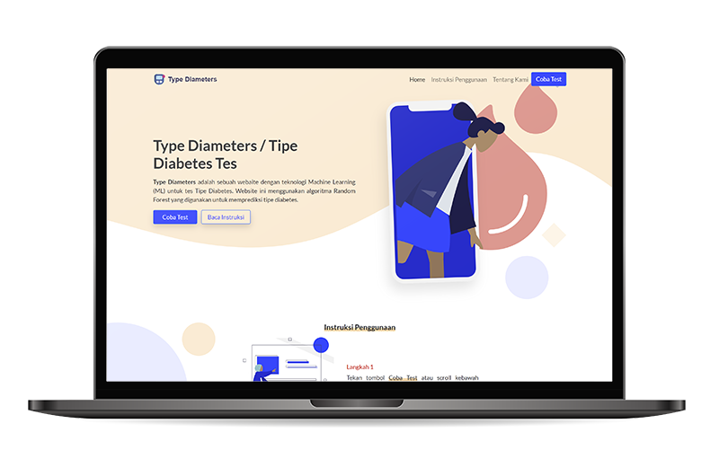

# Implementation Random Forest
Implementation random forest model with python using flask

### you can see this website <a href="https://diameters-test.herokuapp.com/" target="_blank">here</a>

## Description
Dataset:
* <a href="https://data.world/abelvikas/diabetes-type-dataset" target="_blank">Type Diabetes</a>

This website built with:
* <a href="https://www.python.org/" target="_blank">Python 3.8</a>
* <a href="https://flask.palletsprojects.com/en/1.1.x/" target="_blank">Flask</a>
* <a href="https://getbootstrap.com/docs/5.0/getting-started/introduction/" target="_blank">Bootstrap 5</a>
* <a href="https://scikit-learn.org/stable/" target="_blank">Scikit Learn</a>

* Clone this repo:

`$ git clone https://github.com/Fachrulmustofa20/Implementation_RandomForest.git`
